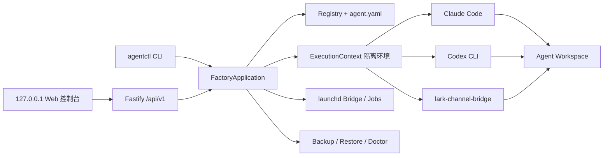

# AI Employee Factory

AI Employee Factory 是一个 macOS 优先的本地 CLI 与 Web 管理控制台，用本机已安装的 Claude Code、OpenAI Codex CLI、lark-channel-bridge 和 launchd 创建长期存在、彻底隔离的 AI 员工。Factory 不运行模型，只负责身份、路径、权限、启动、运维和迁移。

## 架构



Registry 保存本机绑定，`agent.yaml` 保存可迁移身份。两者的 ID、runtime provider 或锁定状态不一致时，Factory 拒绝启动。

## 要求与安装

- macOS，Node.js 20.19.0 或更高版本。
- Git。
- 至少安装 Claude Code 或 Codex CLI 中与目标员工匹配的一个。
- 需要飞书沟通时安装 lark-channel-bridge。

```bash
npm install
npm run build
npm link
agentctl init
```

`scripts/install.sh` 会串行执行上述安装步骤。如果不想全局 link，可在开发期使用 `node dist/cli.js` 替代 `agentctl`。

默认路径：

```text
~/.ai-employees                  # Registry、runtime、Bridge、服务、日志、备份
~/AI-Employees/agents            # 独立 Agent Git 仓库
```

覆盖默认值：

```bash
export AI_EMPLOYEES_HOME=/secure/local/ai-employees
export AI_EMPLOYEES_WORKSPACE_ROOT=/work/ai-agents
```

## Web 管理控制台

```bash
agentctl web                 # 随机端口并自动打开浏览器
agentctl web --no-open       # 只打印本地地址
agentctl web --port 43120    # 指定本机端口
```

页面覆盖首次初始化、总览、员工创建向导、生命周期、身份文档、Job、Skill、实时日志、备份恢复和 Doctor。长时间任务在“操作中心”里通过 SSE 显示进度；完整日志仍保存在员工专属日志目录。

身份文档与 Skills 均为**只读信息台**（D-041 决策①）：身份文档以 Markdown 预览展示（标「只读」，dirty 显示未提交徽章），修改只能通过飞书聊天向员工提出、经批准后由员工更新（`PUT /documents` 后端直接 403）；Skill 的安装/导入/卸载由员工（AI）自主管理，Web 只读展示。

Web 只监听 `127.0.0.1`，每次启动生成一次性 fragment token，交换为 `HttpOnly`/`SameSite=Strict` cookie，修改请求同时检查 Host、Origin 和 CSRF token。关闭 `agentctl web` 后服务和由它启动的未完成子进程会停止。

CC Switch Provider 同步、Codex 登录、飞书扫码/App 授权和交互聊天保持在隔离的终端入口中。Web 页面会显示状态和可复制命令，不在浏览器中模拟终端。

每个员工的 `agent/CURRENT_STATE.md` 由系统与员工共同维护：运行器登录、飞书授权、服务启停、归档/恢复等生命周期事件会自动更新状态行并单文件 git 提交；员工（AI）在工作开始/结束时按运行指南更新「工作进展」段（claude 侧已放行编辑该文件）。任务状态自动更新（D-046）：飞书消息**开始即写**「最近任务：飞书任务 处理中 · …」，**完成写**「完成/失败（退出码 N）· 耗时 · 任务标签」；定时/手动任务与交互对话**只写完成**——每条任务态更新经单文件 git 提交（`chore: 更新当前状态`），Web 进化历史 tab 一眼看到「在做什么 / 做到哪了」。

员工（AI）可在任务执行中自我进化：按运行指南更新自己的目标（`agent/GOALS.md`）、工作系统（`agent/OPERATING_SYSTEM.md`）与规则（`agent/POLICIES.md`），或写回工作过程中的经验到 `knowledge/`、沉淀 `skills/` 与 `workflows/`——系统会自动检测并单文件 git 提交（`evolve:` 前缀），让下次执行更准确。岗位定位（`agent/ROLE.md` 的 `# 岗位定位` 段）与宪法（`agent/CONSTITUTION.md`）由系统从 `agent.yaml.description` 渲染/播种，员工只可提案，改动经用户在飞书聊天批准后由员工落盘。

## 创建员工（描述 → AI 生成骨架）

用一句话描述员工用法，AI 自动生成可编辑的**基础岗位骨架**（岗位名、id、职责定位、核心目标、技能），确认后创建。创建只给骨架——职责/权限/上报等细节由系统按红线模板播种，之后由员工在使用中自进化沉淀（Web 只读，修改走飞书聊天）。不需要、也没有预设：

```bash
agentctl create \
  --describe "帮我建一个负责收集用户反馈、分析并闭环跟进的产品运营" \
  --runtime claude \
  --feishu dedicated
```

`--describe` 先用本地 Claude CLI 生成骨架，再创建；`--dry-run` 可先预览。也可跳过 AI，手动给 `--description` 和 `--goal`。Web 管理台创建页提供同一流程：输入描述 → 「AI 生成骨架」→ 编辑字段 → 确认创建（职责/权限/上报以只读「将播种的基础模板预览」展示，不直接编辑）。

Claude 默认使用 CC Switch 当前启用的 Provider。创建后将 Provider 同步到员工隔离环境：

```bash
agentctl runtime sync user-operations
agentctl runtime status user-operations
```

Factory 只读取 CC Switch live `settings.json` 中经过白名单允许的 `ANTHROPIC_*` 与模型配置，并写入 `~/.ai-employees/runtimes/user-operations/claude/settings.json`。白名单外置在 `presets/cc-switch-allowlist.json`，随 Claude Code 版本更新而不改代码。它不会复制个人 OAuth、会话、历史、MCP、主题或权限；不会修改 CC Switch 和个人 `~/.claude`。每次 chat、run、Agent Job 与 Bridge 启动前都会同步（带 mtime 缓存：源未变则跳过重写），因此在 CC Switch 切换 Provider 后无需官方 Claude 登录；若本机没有 CC Switch 配置，也可在员工 `runtime_home/.cc-switch.env`（0600）预置白名单字段作为降级来源。兼容旧脚本的 `agentctl runtime login <claude-id>` 也只执行同步，不会运行 `claude auth login`。

默认同步「当前 live Provider」；如需让某员工绑定 CC Switch 中的**具体 Provider**（而非 live），用 `--provider` 指定一次，之后每次 spawn 都按该 Provider 同步：

```bash
agentctl runtime sync user-operations --provider Kimi     # 绑定 Kimi 并同步
agentctl runtime sync user-operations --provider live     # 清除绑定，回退当前 live Provider
```

绑定只写在本机 Registry（`credential_provider`，不进便携文件 `agent.yaml`，换机不迁移）；doctor 对绑定状态给出短期 warn（长期将按 provider 不匹配 fail）。读取具体 Provider 配置依赖系统自带 `sqlite3` 只读查询 CC Switch 数据库（macOS/Linux 预装；缺失时该绑定报 NOT_FOUND，不会静默同步到别的 Provider）。

Codex 员工仍通过 `agentctl runtime login <id>` 登录专属 `CODEX_HOME`。

**Runtime 迁移**（D-044）：员工可在 claude ↔ codex 之间显式切换，`agentctl runtime migrate <id> --to <provider> [--dry-run] [--discard]`——内部一致事务（目录 + agent.yaml 先于 Registry 单次原子写，任一步失败不留半迁移态，回滚失败指向 `agentctl repair`）；`--dry-run` 零写入打印计划；迁移会自动重启该员工的 launchd 服务（bridge/settle/Job，plist 烘焙环境变量）并把 skills 投影切换到目标 provider 的发现目录。**凭据不跨 provider 自动复制**（守 D-015）：目标 codex 只预写 `config.toml`（迁移后 `agentctl runtime login <id>` 登录专属 CODEX_HOME）、目标 claude 只建空目录（迁移后 `agentctl runtime sync <id>` 同步 CC Switch Provider）；旧 provider 目录默认保留作回滚逃生口，`--discard` 在成功迁移后删除。

## 飞书绑定与生命周期

```bash
# 使用 Bridge 官方 PersonalAgent 注册流程：终端显示二维码后用飞书扫码
agentctl bridge authorize user-operations

# 或使用已有 App ID；App Secret 由 Bridge 交互式读取，不进入命令行
agentctl bridge authorize user-operations --app-id cli_xxx --tenant feishu

agentctl bridge status user-operations
agentctl start user-operations
agentctl status user-operations
agentctl restart user-operations
agentctl stop user-operations
```

Bridge 使用官方 `@larksuite/channel` WebSocket 长连接，不需要配置 webhook。Factory 生成自有 launchd plist，运行 Bridge 的前台 `run` 命令，从而强制注入 `CLAUDE_CONFIG_DIR`/`CODEX_HOME` 和员工专属 `LARK_CHANNEL_HOME`。plist 不包含 Secret。

授权完成后，Factory 会把 Bridge profile 的 `permissions.defaultAccess` 与 `maxAccess` 收紧为 `workspace`，避免上游默认 `full` 映射为 Claude `bypassPermissions` 或 Codex `danger-full-access`。启动前会再次校验并同步该安全配置。基础即时消息不需要手工编造权限清单；群聊免 @、会议 Agent 等扩展能力应按 Bridge 官方增量授权流程单独开启。

## 聊天、单次任务和日志

```bash
agentctl chat user-operations
agentctl run user-operations "执行今日用户反馈检查" --timeout 900
agentctl logs user-operations --lines 200
agentctl logs user-operations --follow
```

## 员工回收站

员工详情中的“移入回收站”会停止并卸载 Bridge 与全部 Job，然后把 Workspace、Runtime、飞书配置、日志、服务和调度文件一起移出活动目录。员工会立即从 Registry 和员工列表消失，原 Agent ID 可以重新用于测试。

数据由 Factory 保留 7 天，可在“备份恢复 → 员工回收站”中一键恢复；恢复后的员工保持 `stopped`，不会自动启动任何服务。超过 7 天的条目会在下次启动 Web 或运行公开 `agentctl` 命令时永久清理，不安装常驻清理服务。

```bash
# 查看将移动的所有路径，不修改数据
agentctl trash move user-operations --dry-run

# 移入、查看和恢复
agentctl trash move user-operations
agentctl trash list
agentctl trash restore <trash-id>

# 预览或清理已过期条目
agentctl trash purge --expired --dry-run
agentctl trash purge --expired
```

恢复时如果 Agent ID 或任一原路径已被新员工占用，Factory 会拒绝恢复且不会覆盖数据。回收站是普通文件系统保留机制，不是取证级安全擦除。

不要在 Agent 仓库中直接运行 `claude` 或 `codex`。`deployment/` 内的启动器也只委托给 `agentctl`。单次执行将 stdout、stderr、时间和真实退出码保存到 Agent 专属日志目录。

## 定时任务

Agent 在 `automation/jobs/*.yaml` 中定义 Job：

```yaml
schema_version: 1
id: daily-feedback-review
enabled: false
schedule:
  type: daily
  time: '09:00'
execution:
  type: agent
  prompt_file: automation/prompts/daily-feedback-review.md
  timeout_seconds: 900
  concurrency: forbid
```

`script` 任务使用工作区内的 `script_file` 与 `node`/`bash`/`direct` 解释器，不使用 shell 字符串。`agent` 任务可配置 `precheck`：退出 0 时继续调用模型，默认退出 3 表示无新数据并正常结束。

```bash
agentctl job validate user-operations
agentctl job list user-operations
agentctl job run user-operations daily-feedback-review
agentctl job enable user-operations daily-feedback-review
agentctl job disable user-operations daily-feedback-review
```

### 员工自我配置定时任务

员工（AI）可在任务中给自己配置定时任务，无需人工介入：在 `automation/jobs/*.yaml` 写 `managed_by: employee` + `enabled: true`，系统会在每次任务执行结束后自动安装 launchd 调度并单文件 git 提交；删除文件或 `enabled: false` 自动反注册，修改 `schedule.time` 自动重新加载。`managed_by` 缺省为 `admin`，只有 `employee` 任务会被自动 reconcile。（Web「任务」页用 `[员工]/[管理员]` 徽标区分。）

## 飞书使用审计

每条飞书消息的使用记录（耗时/退出码/token/成本/主题）落本地 `logs/usage.db`（D-036）；D-046 起把消息元数据一并上抛——bridge 0.5.9 会把每条消息写成结构化 JSONL 到 `~/.ai-employees/bridges/<id>/profiles/<profile>/logs/bridge-YYYYMMDD.jsonl`，Factory 解析成可查询审计（chat 类型/source/会话/发送者/runId），`runBridgeMessage` 按时间近邻匹配后同步进 usage.db。**完整 ID 仅存本地 0600 库**，CLI/Web 展示一律截断（`…xxxxxx`）。

```bash
agentctl usage query --agent user-operations --limit 20    # 每条消息使用记录（含 chat_type/source/chat_id/msg_id/sender_id/run_id）
agentctl usage summary --agent user-operations             # 按天 + 员工聚合（消息数/平均耗时/总成本/错误数）
agentctl usage audit user-operations --limit 10            # 解析 bridge JSONL → 消息审计表（时间/类型/发送者/预览/结果/耗时/成本）
agentctl usage audit user-operations --since 2026-08-07    # 只列该日期及之后
```

Web 员工详情「进化历史」tab 同样显示「最近飞书消息」列表（chat 类型/来源/发送者截断/预览/退出码/成本）。

## Skill 安装与迁移

Skill 按作用域分为两级：

- **项目级（project）**：存于员工 `workspace/skills/`，投影到 `workspace/.claude/skills`（Claude）/ `workspace/.codex/skills`（Codex）。随工作区 git 进入版本管理，进入默认备份。
- **用户级（user）**：存于员工 `runtimeHome/skills/`（运行器原生用户级发现目录）。属于员工运行时身份，仅随包含 Runtime 的备份打包。

```bash
agentctl skill list user-operations
agentctl skill install user-operations /path/to/feedback-collect            # 默认项目级
agentctl skill install user-operations /path/to/feedback-analyze --scope user
agentctl skill remove user-operations feedback-analyze --scope user
```

将现有 Skill 的真实内容复制到独立源目录，确保每个目录包含 `SKILL.md`，再运行上述 install。Factory 会复制一份到该 Agent，记录版本、作用域和 SHA-256，并生成运行器投影；不同员工永不实时共享软链接。

### Skill 商店

浏览器 Web 控制台的「Skill 商店」页或 CLI 可把远端 GitHub 仓库源作为技能来源，不影响上述上传 / 本地路径 / CLI 安装方式：

```bash
agentctl skill-store list-repos
agentctl skill-store add-repo my-skills https://github.com/owner/repo
agentctl skill-store refresh my-skills
agentctl skill-store list-skills my-skills
agentctl skill-store install user-operations my-skills skills/hello --scope project
```

仓库源浅克隆到 `~/.ai-employees/skill-store/cache/<name>/`，用 `agent-skills.yaml/json` 清单或扫描 `SKILL.md` 发现技能；仅接受 `https://github.com/` 公开仓库。内置默认仓库源（superpowers、anthropic-skills）可在 Web 或 CLI 增删。

## 记忆隔离原理

每次 `chat`、`run`、Bridge 和 Job 执行前，Factory 会清理继承的个人 Runtime/Bridge 路径与常见 API/OAuth 变量，然后只注入当前 Agent 的专属路径。Claude 有一个明确的窄例外：只从 CC Switch 当前配置同步 Provider 白名单字段到员工 Runtime Home。正式事实优先级为：

```text
岗位制度和权限 > 正式业务知识 > 已确认决策 > 正式 Skill > 原生记忆 > 当前会话
```

原生记忆从不是唯一业务事实源，也不能绕过权限。

## 分层自进化协议（D-041）

AI 员工的进化（记忆/岗位/目标/规则/技能）**只在聊天/干活中由 AI 自己持续优化，人工不直接编辑**（修正也通过飞书聊天）；Web 端只读展示。身份文档分四区，按「写入者 / 修订节奏 / 保护强度」不同对待，所有改动进 `evolve:` 单文件提交历史、可回溯：

| 区                     | 文件                                                       | 写入者                       | 保护                                                      |
| ---------------------- | ---------------------------------------------------------- | ---------------------------- | --------------------------------------------------------- |
| **宪法区**（不可变）   | `agent/CONSTITUTION.md`                                    | 仅人（聊天明确指示）         | 内容级硬门：红线锚点只增不改                              |
| **岗位骨架区**（静态） | `agent/ROLE.md`（`# 岗位定位` 段）                         | 仅人（聊天改）；员工只可提案 | 硬门：章节标题不可删；`agent.yaml.description` 为唯一权威 |
| **可进化区**           | `GOALS/OPERATING_SYSTEM/POLICIES`、`skills/`、`knowledge/` | 员工自主                     | 全部 `evolve:` 单文件提交 + 记录→提案→批准 + 陈旧归档     |
| **会话/运行区**        | `logs/`、`usage.db`、`automation/`                         | 系统/员工                    | 不入正式记忆、有上限                                      |

**身份守卫**（`agentctl doctor` 可查）：

- **红线锚点硬门**：`agent/POLICIES.md` 的红线词（`人工审批`/`生产写入`/`对外发布`/`删除数据`/`Git push`）、`agent/ROLE.md` 的岗位定位/长期职责标题与 `agent/CONSTITUTION.md` 的使命/变更流程标题**不可删除或削弱**——系统在 `evolve:` 提交前校验，违规文件拒绝提交并留现场（`git diff` 可查），不自动回滚。
- **身份基线**：系统把五份身份文档（含 `CONSTITUTION.md`）快照到 `agent/IDENTITY_BASELINE.md`（含 sha256），`agent.yaml.description` 为岗位定位唯一权威；基线漂移可被 doctor / 进化历史检测。
- **提案审批**：对核心身份的改动走 `agent/proposals/*.md`（现状→拟改→理由→证据 `because of ...`）→ 飞书聊天里**用户明确「同意/批准」后**才落盘；员工不得自行 proposed→applied。
- **提案账本对账**（P1-3）：员工写提案/批准决策登记到轻量 JSONL 账本 `~/.ai-employees/logs/proposals/<id>.jsonl`（0600，上限 5000 行）。每次 settle 对账——ROLE/POLICIES/CONSTITUTION 相对基线**超出可进化范围**（整删/重写/锚点缺失）的改动，若无带 `user_anchor` 的 `applied` 提案依据，即判「未授权身份改动」。`identity_protocol` 默认 `advisory`（仅告警）；显式设为 `enforced` 后违规文件**拒绝提交** + CURRENT_STATE 留痕（保留脏文件供人工决策，不自动回滚）。
- **身份编辑方式**（D-043）：`agent.yaml` 的 `memory.identity_edits` 默认 `proposal_required`（上述提案门）；设为 `direct`（用户在聊天直接授权可直改核心身份）后对账跳过「未授权」判定——但 **identity-guard 锚点硬门永远生效**（红线词/岗位标题/宪法锚点仍由提交前校验护住，信任模式只放宽流程门，不关闭内容地板）。doctor 的 `proposal-ledger` 检查项在 direct 模式下直接 pass 并标注模式。
- **知识遗忘归档**（P2-1）：`knowledge/lessons/raw|refined/` 超 90 天的陈旧条目自动**移入 `knowledge/.archive/<日期>/<层>/`**（移走非删除、可恢复），从索引与 git 中隐退；`agentctl knowledge archive-list / restore / purge` 可管理，`agentctl knowledge retention` 手动触发。
- **身份回滚**（P2-2）：`agentctl identity rollback <id> <file> [--ref <commit>]` 把身份文档恢复到历史提交内容（git show 写回 + `evolve:` 提交 + 刷新基线），可回退改错的身份；只限身份文档，知识/技能由员工 git 自主管理。
- **进化历史**（P3-1）：Web 员工详情「进化历史」tab 只读展示 `evolve:` 自进化提交流（可回溯）+ CURRENT_STATE + 使用统计；**点开看**——点提交看该提交变更的文件清单（状态徽章 A/M/D/R），点文件看该提交下文件全文（`git show`，只读，禁止越界读取工作区外/git 内部路径）。`agentctl identity proposals <id>` 列出提案账本状态机（含批准依据 `user_anchor`），审计哪些身份改动有批准依据。
- **检索证据链**（P3-3）：`agentctl knowledge recall` 命中二级提炼经验（`lessons/refined/`）时展示 `because of:` 证据链接，可回溯到一级原始记录（`lessons/raw/`）。
- **检索增强**（D-042）：召回引擎升级为 **BM25 排序**（正文全文入索引 + 字段加权 + top-8 相关度下限）、中文整词/字符大词恒开混合（不再全或无回退）、错拼模糊回退、命中带正文**片段 snippet**、索引按 mtime **自动重建**（模型直写 `knowledge/` 后无需手动 rebuild）。**运行时注入**：每次 run / Job / 飞书消息执行前，系统把与当前任务相关的召回结果写入 `knowledge/.retrieved.md` 便签（gitignored、不进索引/不提交），员工开场先读它再干活——检索不再只是命令，而是每次干活默认带上的上下文。
- **doctor 检查项**（P3-2）：`agentctl doctor <id>` 增 6 项自进化健康监控——`identity-baseline`（基线缺失/漂移 warn）、`identity-guard`（锚点缺失 fail）、`proposal-ledger`（未授权身份改动 fail）、`memory-flags`（三开关缺失 warn）、`knowledge-retention`（超期未归档 warn）、`reflection`（refined 缺证据 warn）。
- **知识归档后端**（D-045）：`agentctl archival add <id> <rel-path>` 把可迁移身份知识（`knowledge/**` 或 `agent/` 身份文档）**单条显式归档**到 `~/.ai-employees/logs/archives/<id>.db`（SQLite、0600、WAL；rel-path 参数即 per-entry 授权；落盘前二次 Secret 脱敏；同路径重复归档幂等）；`archival list` 审计、`archival query [--layer] [--limit]` 过滤查询（内容已脱敏）。白名单 + 软链逃逸防护（`assertInsideReal`）。**无自动批量**——D-041 的 retention 自动归档只做本地 `knowledge/.archive` 移走，绝不自动进 archival DB。

## 备份与换电脑

```bash
agentctl backup user-operations
agentctl restore ~/.ai-employees/backups/user-operations-<time>.tar.gz --new-id user-operations-copy
```

默认备份包含 Workspace/Git、Registry 摘要、正式记忆、Job、脱敏 Bridge 配置、manifest 和 SHA-256，排除 `.env`、私钥、Token、Secret、runtime 与日志。

`agentctl backup user-operations --include-runtime` 会交互式读取密码，通过 scrypt + AES-256-GCM 加密。`--new-id` 始终创建全新 runtime/Bridge home，不携带旧员工原生记忆，并清除 Git remotes。恢复后 Claude 需重新同步 CC Switch Provider，Codex 需重新登录，飞书需重新授权。

### 换机授权清单（OP5-C）

换机到新机器后，恢复备份（`agentctl restore`）只恢复 Workspace/正式记忆/配置，**不迁移凭据**。各运行时按以下方式重新授权（详见 `.scratch/op5-c-migration.md` 调研）：

| 运行时      | 换机授权方式                                                                                      | 交互次数            |
| ----------- | ------------------------------------------------------------------------------------------------- | ------------------- |
| Claude      | 在新机配置 CC Switch Provider（或预置员工 `runtime_home/.cc-switch.env`，0600），spawn 前自动同步 | 0（配置一次性）     |
| Codex       | 复制旧机 `~/.codex/auth.json`（官方文档确认 `auth.json` 不绑定主机）或重新 `codex login`          | 0 或 1              |
| 飞书 Bridge | `agentctl bridge authorize <id>` 扫码，或 `--app-id --app-secret --tenant` 用既有应用凭据         | 0~1（扫码须人在场） |

> 注：per-agent Provider 绑定（`--provider <name>`）只写本机 Registry，换机后在新机重新 `runtime sync --provider <name>` 即可恢复。

推荐配置下每员工 0 次交互（复制 `auth.json` + App 凭据 + CC Switch/`.cc-switch.env`）；最坏情形每员工 2 次（Codex 重新登录 + 飞书扫码）。边界：Codex 若配置 Keychain 存储（`cli_auth_credentials_store = "keyring"`）则复制法不适用；Feishu 无现成应用时扫码须人在场。

## 安全与诊断

```bash
agentctl doctor
agentctl doctor user-operations
agentctl archive user-operations --dry-run
agentctl archive user-operations
```

- 外部进程使用 `execa(command, args, { shell: false })`。
- Agent ID 仅允许小写字母、数字和短横线。
- Workspace/runtime/Bridge 路径必须位于各自根目录，且全局唯一。
- Registry 先备份后原子更新，创建与运行使用原子锁。
- Claude 不开启 bypassPermissions；Codex 使用 workspace-write/on-request。
- archive、Job remove 都是可恢复归档，不直接永久删除。Skill remove 是彻底卸载（不可恢复，直接删除技能目录）。

常见问题：

- `Registry 不存在`：运行 `agentctl init`。
- `Bridge Profile 待授权`：运行 `agentctl bridge authorize <id>`。
- `运行器已锁定`：创建新 Agent，迁移正式知识/Skill/任务，归档旧 Agent。
- `操作正在执行`：等待当前任务；若记录 PID 已不存在，下次运行会回收陈旧锁。

## 当前限制与 Roadmap

v1 不包含常驻 Web 服务、局域网/远程访问、账号系统、浏览器内终端、多 Agent 共享机器人 Router、Agent 自由互聊、云端多租户、Skill 市场、生产数据写入、知识图谱或 systemd 实现。核心模型是「单一 AI 员工 + 定时 Job + Web 单轮对话」；Chief 编排、Todo 状态机与 MCP 接入已于 TASK-030（D-027）移除。后续优先项是 systemd adapter 与可选的加密 Secret provider。分层自进化协议（D-041）已完成全部五阶段：三开关默认开 + 经验两级化（M2）、提案对账账本 + Web 只读收敛 + 创建骨架化（M3）、遗忘归档 + 身份 git 回滚（M4）、doctor 检查项 + Web 进化历史 + 检索增强（M5）；检索增强由 D-042 进一步升级为 BM25 召回引擎 + 运行时 RAG 注入（`knowledge/.retrieved.md`）；显式 runtime 迁移工作流已由 D-044（TASK-048）落地（claude ↔ codex 双向）；archival 后端由 D-045（TASK-049）落地（local-sqlite 单条显式归档）；飞书消息元数据上抛 usage 审计 + 任务完成态自动写状态由 D-046（TASK-050）落地。

**关于飞书（D-046 答疑）**：

- **「一个机器人路由给多个员工」**：bridge 的模型是 **profile = 一个飞书应用 = 一个 agent**（`bridge.profile = agent.id`，独立 app-id/secret，`LARK_CHANNEL_HOME` 按员工隔离）；路由是**按 profile、不按消息**。当前每员工一个专属机器人；「单一飞书机器人收到消息后由 Router（在 Factory 层）决定派给哪个员工」不在 v1 范围（即上述「多 Agent 共享机器人 Router」），bridge 本身也不支持按消息路由。影响：管 N 个员工 = 管 N 个飞书应用。
- **bridge 版本（0.5.9 vs 0.7.0）**：官方无 changelog/releases。0.5.9 已具备 Factory 依赖的全能力（streaming 卡片、COT、会话连续性、排队、全部斜杠命令、workspace 权限收紧、结构化 JSONL 日志含 costUsd）；缺**飞书文档评论**（Factory 不用的可选能力）与 0.6.0–0.7.0 未公开修复。对本项目影响低风险，升级非紧急；若升级改了 JSONL schema，`usage audit` parser 已有容错。

## 开发验证

```bash
npm run build
npm test
npm run lint
npm run test:e2e
```

测试使用临时 HOME/Workspace，不调用真实 Claude、Codex 或飞书 API。详见 [docs/TESTING.md](docs/TESTING.md)。
