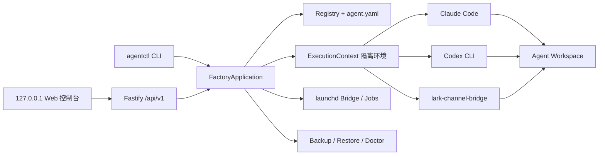

# AI Employee Factory

AI Employee Factory 是一个 macOS 优先的本地 CLI 与 Web 管理控制台，用本机已安装的 Claude Code、OpenAI Codex CLI、lark-channel-bridge 和 launchd 创建长期存在、彻底隔离的 AI 员工。Factory 不运行模型，只负责身份、路径、权限、启动、运维和迁移。

## 架构



Registry 保存本机绑定，`agent.yaml` 保存可迁移身份。两者的 ID、runtime provider 或锁定状态不一致时，Factory 拒绝启动。

## 要求与安装

- macOS，Node.js 20.19.0 或更高版本。
- Git。
- 至少安装 Claude Code 或 Codex CLI 中与目标员工匹配的一个。
- 需要飞书沟通时安装 lark-channel-bridge。

```bash
npm install
npm run build
npm link
agentctl init
```

`scripts/install.sh` 会串行执行上述安装步骤。如果不想全局 link，可在开发期使用 `node dist/cli.js` 替代 `agentctl`。

默认路径：

```text
~/.ai-employees                  # Registry、runtime、Bridge、服务、日志、备份
~/AI-Employees/agents            # 独立 Agent Git 仓库
```

覆盖默认值：

```bash
export AI_EMPLOYEES_HOME=/secure/local/ai-employees
export AI_EMPLOYEES_WORKSPACE_ROOT=/work/ai-agents
```

## Web 管理控制台

```bash
agentctl web                 # 随机端口并自动打开浏览器
agentctl web --no-open       # 只打印本地地址
agentctl web --port 43120    # 指定本机端口
```

页面覆盖首次初始化、总览、员工创建向导、生命周期、五类身份文档、Job、Skill、实时日志、备份恢复和 Doctor。长时间任务在“操作中心”里通过 SSE 显示进度；完整日志仍保存在员工专属日志目录。

Web 只监听 `127.0.0.1`，每次启动生成一次性 fragment token，交换为 `HttpOnly`/`SameSite=Strict` cookie，修改请求同时检查 Host、Origin 和 CSRF token。关闭 `agentctl web` 后服务和由它启动的未完成子进程会停止。

Runtime 登录、飞书扫码/App 授权和交互聊天保持在隔离的终端入口中。Web 页面会显示状态和可复制命令，不在浏览器中模拟终端。

## 创建用户运营专员

```bash
agentctl create \
  --id user-operations \
  --name "用户运营专员" \
  --runtime claude \
  --preset user-operations \
  --feishu dedicated
```

创建后完成隔离登录：

```bash
agentctl runtime login user-operations
agentctl runtime status user-operations
```

Claude 登录存入 `~/.ai-employees/runtimes/user-operations/claude`，不会写入个人 `~/.claude`。Codex 员工同理使用专属 `CODEX_HOME`。

## 飞书绑定与生命周期

```bash
# QR 创建/授权专属机器人
agentctl bridge authorize user-operations

# 或使用已有 App ID；App Secret 由 Bridge 交互式读取，不进入命令行
agentctl bridge authorize user-operations --app-id cli_xxx --tenant feishu

agentctl bridge status user-operations
agentctl start user-operations
agentctl status user-operations
agentctl restart user-operations
agentctl stop user-operations
```

Factory 生成自有 launchd plist，运行 Bridge 的前台 `run` 命令，从而强制注入 `CLAUDE_CONFIG_DIR`/`CODEX_HOME` 和 `LARK_CHANNEL_HOME`。plist 不包含 Secret。

## 聊天、单次任务和日志

```bash
agentctl chat user-operations
agentctl run user-operations "执行今日用户反馈检查" --timeout 900
agentctl logs user-operations --lines 200
agentctl logs user-operations --follow
```

不要在 Agent 仓库中直接运行 `claude` 或 `codex`。`deployment/` 内的启动器也只委托给 `agentctl`。单次执行将 stdout、stderr、时间和真实退出码保存到 Agent 专属日志目录。

## 定时任务

Agent 在 `automation/jobs/*.yaml` 中定义 Job：

```yaml
schema_version: 1
id: daily-feedback-review
enabled: false
schedule:
  type: daily
  time: '09:00'
execution:
  type: agent
  prompt_file: automation/prompts/daily-feedback-review.md
  timeout_seconds: 900
  concurrency: forbid
```

`script` 任务使用工作区内的 `script_file` 与 `node`/`bash`/`direct` 解释器，不使用 shell 字符串。`agent` 任务可配置 `precheck`：退出 0 时继续调用模型，默认退出 3 表示无新数据并正常结束。

```bash
agentctl job validate user-operations
agentctl job list user-operations
agentctl job run user-operations daily-feedback-review
agentctl job enable user-operations daily-feedback-review
agentctl job disable user-operations daily-feedback-review
```

## Skill 安装与迁移

```bash
agentctl skill list user-operations
agentctl skill install user-operations /path/to/feedback-collect
agentctl skill install user-operations /path/to/feedback-analyze
agentctl skill remove user-operations feedback-analyze
```

将现有两个 Skill 的真实内容复制到独立源目录，确保每个目录包含 `SKILL.md`，再运行上述 install。Factory 会复制一份到该 Agent，记录版本和 SHA-256，并生成运行器投影；不同员工永不实时共享软链接。

## 记忆隔离原理

每次 `chat`、`run`、Bridge 和 Job 执行前，Factory 会清理继承的个人 Runtime/Bridge 路径与常见 API/OAuth 变量，然后只注入当前 Agent 的专属路径。正式事实优先级为：

```text
岗位制度和权限 > 正式业务知识 > 已确认决策 > 正式 Skill > 原生记忆 > 当前会话
```

原生记忆从不是唯一业务事实源，也不能绕过权限。

## 备份与换电脑

```bash
agentctl backup user-operations
agentctl restore ~/.ai-employees/backups/user-operations-<time>.tar.gz --new-id user-operations-copy
```

默认备份包含 Workspace/Git、Registry 摘要、正式记忆、Job、脱敏 Bridge 配置、manifest 和 SHA-256，排除 `.env`、私钥、Token、Secret、runtime 与日志。

`agentctl backup user-operations --include-runtime` 会交互式读取密码，通过 scrypt + AES-256-GCM 加密。`--new-id` 始终创建全新 runtime/Bridge home，不携带旧员工原生记忆，并清除 Git remotes。恢复后需重新登录和授权。

## 安全与诊断

```bash
agentctl doctor
agentctl doctor user-operations
agentctl archive user-operations --dry-run
agentctl archive user-operations
```

- 外部进程使用 `execa(command, args, { shell: false })`。
- Agent ID 仅允许小写字母、数字和短横线。
- Workspace/runtime/Bridge 路径必须位于各自根目录，且全局唯一。
- Registry 先备份后原子更新，创建与运行使用原子锁。
- Claude 不开启 bypassPermissions；Codex 使用 workspace-write/on-request。
- archive、Skill/Job remove 都是可恢复归档，不直接永久删除。

常见问题：

- `Registry 不存在`：运行 `agentctl init`。
- `Bridge Profile 待授权`：运行 `agentctl bridge authorize <id>`。
- `运行器已锁定`：创建新 Agent，迁移正式知识/Skill/任务，归档旧 Agent。
- `操作正在执行`：等待当前任务；若记录 PID 已不存在，下次运行会回收陈旧锁。

## 当前限制与 Roadmap

v1 不包含常驻 Web 服务、局域网/远程访问、账号系统、浏览器内终端、多 Agent 共享机器人 Router、Agent 自由互聊、云端多租户、Skill 市场、生产数据写入、知识图谱或 systemd 实现。后续优先项是 systemd adapter、显式 runtime 迁移工作流、可选的加密 Secret provider 和多 Agent 协调层。

## 开发验证

```bash
npm run build
npm test
npm run lint
npm run test:e2e
```

测试使用临时 HOME/Workspace，不调用真实 Claude、Codex 或飞书 API。详见 [docs/TESTING.md](docs/TESTING.md)。
