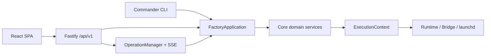

# Architecture

## 模块边界

- `src/cli-program.ts`：公开 CLI 与人机交互，只解析参数、确认和呈现结果。
- `src/application/`：`FactoryApplication` 及聚焦用例，是 CLI 和 Web 共用的唯一业务编排层。
- `src/web/`：Fastify 本地 API、会话/CSRF 边界、异步 Operation 与静态资源托管。
- `web/`：React/Vite 中文单页控制台，不直接访问文件系统或执行命令。
- `src/core/`：路径、Schema 组合、Registry、原子锁、模板、创建、执行、Job、Skill、Skill 商店、备份与诊断。
- `src/runtimes/`：Claude/Codex 命令和 ExecutionContext，不直接执行进程。
- `src/services/`：ServiceAdapter 和 launchd 实现；未来 systemd 实现不得改变 CLI 语义。
- `src/schemas/`：版本化 Zod 数据合同。
- `presets/` 与 `templates/`：可审查、不含 Secret 的生成源。

## 依赖与数据流

CLI 和 Fastify 路由依赖 application；application 编排 core；core 可依赖 schema 与 adapter 接口；adapter 不反向依赖 CLI/Web。所有外部进程在执行前先生成包含 argv、cwd 和受控 env 的 ExecutionContext。

Registry 是本机绑定真相，Agent 仓库中的 `agent.yaml` 是可迁移身份真相。正式业务记忆在 Agent 仓库，原生会话/自动记忆在专属 runtime home，飞书状态在专属 Bridge home。

Claude 默认 Provider 来自 CC Switch。应用层在 Claude chat、run、Agent Job 和 Bridge 启动前读取 CC Switch 当前 live `settings.json`，只将允许的 Provider 环境字段原子同步到员工专属 `CLAUDE_CONFIG_DIR`；个人 OAuth、会话、历史和非 Provider 设置不进入员工目录。Codex 继续在员工专属 `CODEX_HOME` 内独立登录。

## 事务与安全

Registry 写入、Agent 创建、恢复和 Skill 安装使用 staging + rename，失败时只回滚当次新建路径。Registry 更新前备份，且使用同目录临时文件原子替换。运行器、Bridge 与 Job 不允许 `shell: true`。

Skill 按作用域分别存储：**项目级**存于 `workspace/skills/` 并投影到 `workspace/.claude/skills` / `workspace/.codex/skills`，随工作区 git 和默认备份；**用户级**原位存于 `runtimeHome/skills/`（运行器原生用户级发现目录），仅随包含 Runtime 的备份打包。Skill 商店（`SkillStoreService`）把 `config.yaml` 声明的 GitHub 仓库源浅克隆到 `~/.ai-employees/skill-store/cache/<name>/`，用 `agent-skills.yaml/json` 清单或扫描 `SKILL.md` 发现技能，安装复用 `SkillService.install`（传递源路径），从而不改变任何既有安装方式。

员工回收站由 `TrashService` 管理。每个受管组件先移动到原父目录下的 `.agentctl-trash/<trash-id>/`，从而保持同文件系统 rename；全部成功后才从 Registry 移除。失败时按相反顺序回滚。中心 manifest 只记录 Registry 快照、路径和时间，不读取文件内容。恢复拒绝 ID/路径冲突，过期清理只处理 `ready` 且至少保留 7 天的条目。

Web 仅绑定 `127.0.0.1`：启动 URL fragment 中的一次性 token 交换为 HttpOnly 会话 cookie，修改请求额外验证 Host、Origin 和 CSRF token。受控文档只能映射到 `agent.yaml` 声明的五个 key；日志跟随不接受浏览器文件路径。Operation 只在当次 Web 进程内保留最近 200 条状态和每条最近 1000 个事件。

飞书采用 `lark-coding-agent-bridge` 官方 PersonalAgent 注册与 WebSocket 长连接。Factory 保持每员工独立 `LARK_CHANNEL_HOME`，并在授权和启动边界把 profile 权限固定为 `workspace/workspace`；不使用 Bridge 自带 daemon，也不把 App Secret 放入 argv、plist 或日志。

## OP1 Stage E：archival 后端前置约束

外部/持久化 archival 后端（`local-sqlite` / `external`）当前**仅定义契约、不实现**（`src/core/archival.ts`，默认 `none`）。任何后端落地前必须满足 D-014 的 frozen 写入不变量：写入前经 `SECRET_PATTERN` 过滤、用户显式 per-entry 授权、只归档工作区可迁移身份知识（不传输 `runtime_home` / `bridge` 内容）、网络面与多租户威胁模型经安全评审。本地归档区（`archive`/`trash`/`PruneService.archives`）是另一概念，语义不受影响。

## 工程边界

v1 为本地单用户 macOS 工具，不是强安全多租户沙箱。`workspace` 权限和人工审批是默认防线；若需要对不可信 Agent 进行 OS 级强隔离，应另行增加容器或虚拟机边界。
