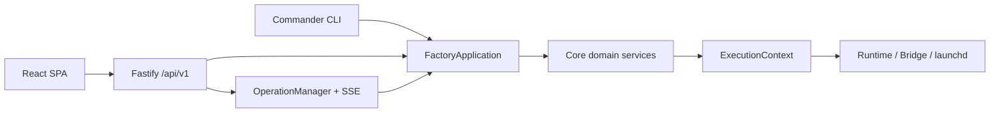

# Architecture

## 模块边界

- `src/cli-program.ts`：公开 CLI 与人机交互，只解析参数、确认和呈现结果。
- `src/application/`：`FactoryApplication` 及聚焦用例，是 CLI 和 Web 共用的唯一业务编排层。
- `src/web/`：Fastify 本地 API、会话/CSRF 边界、异步 Operation 与静态资源托管。
- `web/`：React/Vite 中文单页控制台，不直接访问文件系统或执行命令。
- `src/core/`：路径、Schema 组合、Registry、原子锁、模板、创建、执行、Job、Skill、Skill 商店、备份与诊断。
- `src/runtimes/`：Claude/Codex 命令和 ExecutionContext，不直接执行进程。
- `src/services/`：ServiceAdapter、launchd 实现与按 `service_provider` 分发的工厂（`createServiceFactory`）；systemd 适配器为桩（`install()` 抛 `DEPENDENCY_MISSING`），实现不得改变 CLI 语义。
- `src/schemas/`：版本化 Zod 数据合同。
- `presets/` 与 `templates/`：可审查、不含 Secret 的生成源。

## 依赖与数据流

CLI 和 Fastify 路由依赖 application；application 编排 core；core 可依赖 schema 与 adapter 接口；adapter 不反向依赖 CLI/Web。所有外部进程在执行前先生成包含 argv、cwd 和受控 env 的 ExecutionContext。

Registry 是本机绑定真相，Agent 仓库中的 `agent.yaml` 是可迁移身份真相。正式业务记忆在 Agent 仓库，原生会话/自动记忆在专属 runtime home，飞书状态在专属 Bridge home。

Claude 默认 Provider 来自 CC Switch。应用层在 Claude chat、run、Agent Job 和 Bridge 启动前读取 CC Switch 当前 live `settings.json`，只将允许的 Provider 环境字段原子同步到员工专属 `CLAUDE_CONFIG_DIR`；个人 OAuth、会话、历史和非 Provider 设置不进入员工目录。Codex 继续在员工专属 `CODEX_HOME` 内独立登录。

## 事务与安全

Registry 写入、Agent 创建、恢复和 Skill 安装使用 staging + rename，失败时只回滚当次新建路径。Registry 更新前备份，且使用同目录临时文件原子替换。运行器、Bridge 与 Job 不允许 `shell: true`。

Skill 按作用域分别存储：**项目级**存于 `workspace/skills/` 并投影到 `workspace/.claude/skills` / `workspace/.codex/skills`，随工作区 git 和默认备份；**用户级**原位存于 `runtimeHome/skills/`（运行器原生用户级发现目录），仅随包含 Runtime 的备份打包。Skill 商店（`SkillStoreService`）把 `config.yaml` 声明的 GitHub 仓库源浅克隆到 `~/.ai-employees/skill-store/cache/<name>/`，用 `agent-skills.yaml/json` 清单或扫描 `SKILL.md` 发现技能，安装复用 `SkillService.install`（传递源路径），从而不改变任何既有安装方式。

员工回收站由 `TrashService` 管理。每个受管组件先移动到原父目录下的 `.agentctl-trash/<trash-id>/`，从而保持同文件系统 rename；全部成功后才从 Registry 移除。失败时按相反顺序回滚。中心 manifest 只记录 Registry 快照、路径和时间，不读取文件内容。恢复拒绝 ID/路径冲突，过期清理只处理 `ready` 且至少保留 7 天的条目。

Web 仅绑定 `127.0.0.1`：启动 URL fragment 中的一次性 token 交换为 HttpOnly 会话 cookie，修改请求额外验证 Host、Origin 和 CSRF token。受控文档只能映射到 `agent.yaml` 声明的五个 key；日志跟随不接受浏览器文件路径。Operation 只在当次 Web 进程内保留最近 200 条状态和每条最近 1000 个事件。

**CURRENT_STATE.md 自动更新（D-025）**：`agent/CURRENT_STATE.md` 采用「系统标记块 + 员工工作进展段」结构（`src/core/current-state.ts`）。系统侧生命周期事件（运行器登录、飞书授权、服务启停、归档/恢复）自动更新标记块内的行级 KV（状态/运行器/飞书/最近事件），只改目标 key 行、块外内容原样保留；无标记块且被人工改过则跳过并警告（永不覆盖他人成果）。更新后经 `gitCommitFile`（`src/core/git.ts`，单文件 add+commit，绝不用 `add -A`）自动提交，badge 语义变准。员工侧由 CLAUDE.md/AGENTS.md 引导维护「工作进展」段，claude 侧工作区 `.claude/settings.json` 放行编辑该文件（存量员工由 `prepareRuntime` 幂等补放行）。

飞书采用 `lark-coding-agent-bridge` 官方 PersonalAgent 注册与 WebSocket 长连接。Factory 保持每员工独立 `LARK_CHANNEL_HOME`，并在授权和启动边界把 profile 权限固定为 `workspace/workspace`；不使用 Bridge 自带 daemon，也不把 App Secret 放入 argv、plist 或日志。

## Chief 编排与 Todo 状态机

`role` 为 `chief` 的员工可编排多名 `worker`，顶层一句话闭环：拆解 → 计划确认门 → 波次派发 → Chief 交叉审查单向搬运 → 人工合并。计划按「创建者」落在其自有 workspace 的 `tasks/plans/`（`TaskStore`），不跨员工共享实时目录。

- **计划级状态机** `draft → [active, cancelled]`：`draft` 是人工确认门（`confirmPlan` 确认可派发 / `rejectPlan` 驳回可附 note）；`active` 可派发，`completed/cancelled` 为终态。
- **任务项状态机**（7+2）：`pending → queued → planning → awaiting_confirmation → developing → awaiting_review → completed`，外加终止态 `failed/cancelled`。`runTaskPlan` 波次派发：依赖阻塞、失败不阻塞同级、已成功跳过、可选并发（1–8）；中断孤儿项经 `reconcile` 标记失败。
- **审查门（D-017 单向搬运）**：`reviewTaskPlan` 由编排器读 worker 的 `diff.patch` 与 `logs/<worker>/runs/<slug>/stdout.log`，经 `redactSecrets` 脱敏后喂 Chief，Chief 返回结构化 `verdict+note` 写入 `item.review`；item 停留 `awaiting_review` 待人工确认合并（`confirmReview`→completed）或驳回返工（`rejectReview`→developing）。Chief 全程零 worker 文件系统访问，D-003 隔离不变。
- **Web 视图（D-024 起可编排）**：员工详情页「Todo 任务」标签（与「任务」= 定时 Job 区分）按 2 秒轮询展示计划与任务项状态；`draft` 计划提供确认/驳回门，`awaiting_review` 项渲染审查结论并提供确认合并/驳回返工；**可新建计划**（planId 由前端生成 `plan-<8hex>`）、**draft 计划展开可加任务项**、`active` 计划可「派发执行」——全部写操作返回 202 + OperationDto，前端轮询操作中心（D-024）。**Chief 编排视图**（仅 `role=chief` 员工显示）：把 Chief 拥有的每个目标（plan）渲染成一条流水线卡片——阶段条（拆解 → 计划确认 → 执行 → 审查 → 结果，按派生状态点亮）+ 聚合整体进度（如 `2/3 完成 · 1 待审查`），展开复用任务项渲染与两种闸门；顶部「发起目标」表单走 `chief-run`（拆解在后台 Operation 跑，完成停在 draft 等确认）。**对话标签**（所有员工）：单轮问答（`claude -p` / `codex exec` 非交互），走 `runChat` + `runLogged`（复用 transcript/experience 管线，`transcript_persist` opt-in），Operation 完成时把最终回答作为 output 事件写入，前端轮询读回。
- **MCP**：`POST/GET /mcp` 以静态 bearer 认证注册 13 个工具（读 8 + 编排写 5），薄适配器穿过 `FactoryApplication` 单一 seam，与 Web/CLI 共享行为与脱敏约束（D-018/D-021）。

## OP1 Stage E：archival 后端前置约束

外部/持久化 archival 后端（`local-sqlite` / `external`）当前**仅定义契约、不实现**（`src/core/archival.ts`，默认 `none`）。任何后端落地前必须满足 D-014 的 frozen 写入不变量：写入前经 `SECRET_PATTERN` 过滤、用户显式 per-entry 授权、只归档工作区可迁移身份知识（不传输 `runtime_home` / `bridge` 内容）、网络面与多租户威胁模型经安全评审。本地归档区（`archive`/`trash`/`PruneService.archives`）是另一概念，语义不受影响。

## OP5-E：PathLayout 路径布局收敛（R25）

`resolvePathLayout` 返回数据契约 `PathLayout`（home、workspaceRoot、managedDirs）。收敛语义（`src/core/paths.ts` 注释 + `assertPathLayout`）：

- **两棵树**：`home`（所有受管目录：registry/runtimes/bridges/services/schedules/logs/backups/trash/locks/skill-store）与 `workspaceRoot`（每个员工 workspace）。所有受管根目录必须位于 home 或 workspaceRoot 树内。
- **外置卷**：默认不支持直接把外部路径作为受管目录。外置存储须先用 **bind mount 或符号链接**挂到 home/workspaceRoot 树内，并经 `assertInsideReal`（OP2-B，realpath 解析 + 拒软链接逃逸）校验；直接把外部路径当受管目录会被拒绝。
- **根覆盖是刻意选择**：用户可用 `AI_EMPLOYEES_HOME` / `AI_EMPLOYEES_WORKSPACE_ROOT` 把根覆盖到外置卷（README「覆盖默认值」）。该覆盖不硬失败，但受管目录仍须经 `assertInside`/`assertInsideReal` 落回树内；对「根位于 userHome 之外」的外置覆盖，doctor 应告警（未来批次）。
- **`assertPathLayout`**：同步、零 I/O 的收敛校验，供初始化/doctor 等入口调用。

## 工程边界

v1 为本地单用户 macOS 工具，不是强安全多租户沙箱。`workspace` 权限和人工审批是默认防线；若需要对不可信 Agent 进行 OS 级强隔离，应另行增加容器或虚拟机边界。
