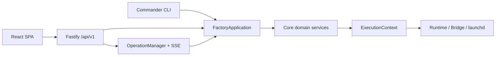

# Architecture

## 模块边界

- `src/cli-program.ts`：公开 CLI 与人机交互，只解析参数、确认和呈现结果。
- `src/application/`：`FactoryApplication` 及聚焦用例，是 CLI 和 Web 共用的唯一业务编排层。
- `src/web/`：Fastify 本地 API、会话/CSRF 边界、异步 Operation 与静态资源托管。
- `web/`：React/Vite 中文单页控制台，不直接访问文件系统或执行命令。
- `src/core/`：路径、Schema 组合、Registry、原子锁、模板、创建、执行、Job、Skill、备份与诊断。
- `src/runtimes/`：Claude/Codex 命令和 ExecutionContext，不直接执行进程。
- `src/services/`：ServiceAdapter 和 launchd 实现；未来 systemd 实现不得改变 CLI 语义。
- `src/schemas/`：版本化 Zod 数据合同。
- `presets/` 与 `templates/`：可审查、不含 Secret 的生成源。

## 依赖与数据流

CLI 和 Fastify 路由依赖 application；application 编排 core；core 可依赖 schema 与 adapter 接口；adapter 不反向依赖 CLI/Web。所有外部进程在执行前先生成包含 argv、cwd 和受控 env 的 ExecutionContext。

Registry 是本机绑定真相，Agent 仓库中的 `agent.yaml` 是可迁移身份真相。正式业务记忆在 Agent 仓库，原生会话/自动记忆在专属 runtime home，飞书状态在专属 Bridge home。

## 事务与安全

Registry 写入、Agent 创建、恢复和 Skill 安装使用 staging + rename，失败时只回滚当次新建路径。Registry 更新前备份，且使用同目录临时文件原子替换。运行器、Bridge 与 Job 不允许 `shell: true`。

Web 仅绑定 `127.0.0.1`：启动 URL fragment 中的一次性 token 交换为 HttpOnly 会话 cookie，修改请求额外验证 Host、Origin 和 CSRF token。受控文档只能映射到 `agent.yaml` 声明的五个 key；日志跟随不接受浏览器文件路径。Operation 只在当次 Web 进程内保留最近 200 条状态和每条最近 1000 个事件。

## 工程边界

v1 为本地单用户 macOS 工具，不是强安全多租户沙箱。`workspace` 权限和人工审批是默认防线；若需要对不可信 Agent 进行 OS 级强隔离，应另行增加容器或虚拟机边界。
